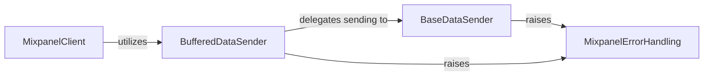

## Component Details

This graph illustrates the core components of the Mixpanel client library, focusing on how data is buffered and sent to the Mixpanel API. The `MixpanelClient` serves as the main user interface, abstracting the data transmission process. It utilizes the `BufferedDataSender` to optimize network usage by batching messages. The `BufferedDataSender`, in turn, delegates the actual HTTP communication to the `BaseDataSender`. Error handling across these data sending components is managed by `MixpanelErrorHandling`.

### BufferedDataSender
Enhances the BaseDataSender by providing a buffering mechanism. It accumulates multiple data points for an endpoint and sends them in batches, optimizing network usage. It also exposes a `flush` method to force immediate transmission of buffered data.

**Related Classes/Methods**:

- <a href="https://github.com/mixpanel/mixpanel-python/blob/master/mixpanel/__init__.py#L636-L738" target="_blank" rel="noopener noreferrer">`mixpanel.__init__.BufferedConsumer` (636:738)</a>
- <a href="https://github.com/mixpanel/mixpanel-python/blob/master/mixpanel/__init__.py#L682-L713" target="_blank" rel="noopener noreferrer">`mixpanel.__init__.BufferedConsumer.send` (682:713)</a>
- <a href="https://github.com/mixpanel/mixpanel-python/blob/master/mixpanel/__init__.py#L715-L722" target="_blank" rel="noopener noreferrer">`mixpanel.__init__.BufferedConsumer.flush` (715:722)</a>
- <a href="https://github.com/mixpanel/mixpanel-python/blob/master/mixpanel/__init__.py#L724-L738" target="_blank" rel="noopener noreferrer">`mixpanel.__init__.BufferedConsumer._flush_endpoint` (724:738)</a>

### MixpanelClient
The primary interface for users to interact with the Mixpanel API, providing methods for tracking events, managing user profiles (people), and managing group profiles. It abstracts the underlying data sending mechanism.

**Related Classes/Methods**:

- `mixpanel.Mixpanel` (full file reference)
- `mixpanel.DatetimeSerializer` (full file reference)
- `mixpanel.json_dumps` (full file reference)

### BaseDataSender
Handles the direct HTTP communication with Mixpanel API endpoints. It manages request parameters, authentication, timeouts, and retries for individual data transmissions.

**Related Classes/Methods**:

- `mixpanel.Consumer` (full file reference)
- `mixpanel.Consumer.send` (full file reference)
- `mixpanel.Consumer._write_request` (full file reference)

### MixpanelErrorHandling
Defines a custom exception class used throughout the Mixpanel client library to signal errors related to API communication, invalid endpoints, or server responses.

**Related Classes/Methods**:

- `mixpanel.MixpanelException` (full file reference)

### [FAQ](https://github.com/CodeBoarding/GeneratedOnBoardings/tree/main?tab=readme-ov-file#faq)