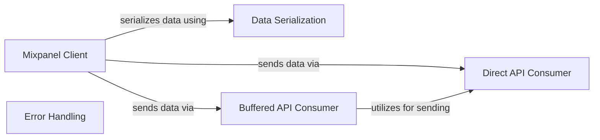

## Component Details

This graph illustrates the core components of the Mixpanel client library, focusing on how data is prepared, serialized, and transmitted to the Mixpanel API. The main flow involves the Mixpanel Client initiating tracking or profile updates, which then utilize the Data Serialization component to format the data. The serialized data is subsequently sent to Mixpanel either directly via the Direct API Consumer or in batches through the Buffered API Consumer. Error handling is managed by a dedicated exception class.

### Mixpanel Client
The core client for interacting with the Mixpanel API. It provides methods for tracking events, managing user profiles (people and groups), and handling aliases and data imports. It orchestrates the data preparation and delegates the actual sending to a consumer.

**Related Classes/Methods**:

- `mixpanel.Mixpanel` (full file reference)
- `mixpanel.Mixpanel:track` (full file reference)
- `mixpanel.Mixpanel:import_data` (full file reference)
- `mixpanel.Mixpanel:alias` (full file reference)
- `mixpanel.Mixpanel:merge` (full file reference)
- `mixpanel.Mixpanel:people_set` (full file reference)
- `mixpanel.Mixpanel:people_set_once` (full file reference)
- `mixpanel.Mixpanel:people_increment` (full file reference)
- `mixpanel.Mixpanel:people_append` (full file reference)
- `mixpanel.Mixpanel:people_union` (full file reference)
- `mixpanel.Mixpanel:people_unset` (full file reference)
- `mixpanel.Mixpanel:people_remove` (full file reference)
- `mixpanel.Mixpanel:people_delete` (full file reference)
- `mixpanel.Mixpanel:people_track_charge` (full file reference)
- `mixpanel.Mixpanel:people_clear_charges` (full file reference)
- `mixpanel.Mixpanel:people_update` (full file reference)
- `mixpanel.Mixpanel:group_set` (full file reference)
- `mixpanel.Mixpanel:group_set_once` (full file reference)
- `mixpanel.Mixpanel:group_union` (full file reference)
- `mixpanel.Mixpanel:group_unset` (full file reference)
- `mixpanel.Mixpanel:group_remove` (full file reference)
- `mixpanel.Mixpanel:group_delete` (full file reference)
- `mixpanel.Mixpanel:group_update` (full file reference)

### Data Serialization
This component is responsible for converting Python data structures into a JSON string format suitable for transmission to the Mixpanel API. It includes a custom serializer for datetime objects.

**Related Classes/Methods**:

- <a href="https://github.com/mixpanel/mixpanel-python/blob/master/mixpanel/__init__.py#L36-L42" target="_blank" rel="noopener noreferrer">`mixpanel.__init__.DatetimeSerializer` (36:42)</a>
- <a href="https://github.com/mixpanel/mixpanel-python/blob/master/mixpanel/__init__.py#L45-L47" target="_blank" rel="noopener noreferrer">`mixpanel.__init__.json_dumps` (45:47)</a>

### Direct API Consumer
Handles the direct communication with the Mixpanel API endpoints. It sends individual messages as HTTP requests and manages network-related concerns like timeouts and retries.

**Related Classes/Methods**:

- `mixpanel.Consumer` (full file reference)

### Buffered API Consumer
Provides an optimized way to send data to Mixpanel by buffering multiple messages and sending them in batches. This reduces the overhead of individual HTTP requests and improves efficiency.

**Related Classes/Methods**:

- `mixpanel.BufferedConsumer` (full file reference)

### Error Handling
Defines a custom exception for errors that occur during the process of sending data to Mixpanel, typically related to network issues or invalid API responses.

**Related Classes/Methods**:

- `mixpanel.MixpanelException` (full file reference)

### [FAQ](https://github.com/CodeBoarding/GeneratedOnBoardings/tree/main?tab=readme-ov-file#faq)