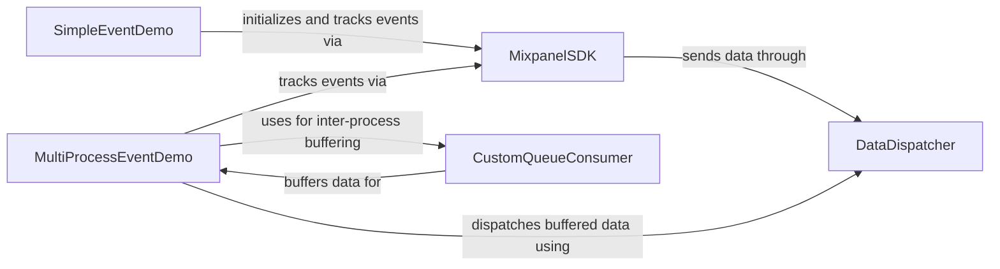

## Component Details

This component overview details the structure and interactions within the Mixpanel Python client library, focusing on its demonstration applications and core functionalities. The main flow involves demo applications initializing the Mixpanel SDK to track events, which then delegates the actual data transmission to a data dispatcher. For multi-process scenarios, a custom queue-based consumer is introduced to facilitate asynchronous event handling, with a buffered consumer managing batch dispatches to the Mixpanel API.

### SimpleEventDemo
A basic demonstration script showcasing how to initialize the Mixpanel client and track a single event.

**Related Classes/Methods**:

- <a href="https://github.com/mixpanel/mixpanel-python/blob/master/demo/post_an_event.py#L3-L5" target="_blank" rel="noopener noreferrer">`demo.post_an_event:post_event` (3:5)</a>
- `mixpanel.Mixpanel` (60:63)
- `mixpanel.Mixpanel.track` (65:87)

### MultiProcessEventDemo
An advanced demonstration illustrating asynchronous event tracking in a multi-process environment, utilizing a custom queue-based consumer and a buffered consumer for efficient data dispatch.

**Related Classes/Methods**:

- <a href="https://github.com/mixpanel/mixpanel-python/blob/master/demo/subprocess_consumer.py#L34-L44" target="_blank" rel="noopener noreferrer">`demo.subprocess_consumer:do_tracking` (34:44)</a>
- <a href="https://github.com/mixpanel/mixpanel-python/blob/master/demo/subprocess_consumer.py#L46-L55" target="_blank" rel="noopener noreferrer">`demo.subprocess_consumer:do_sending` (46:55)</a>
- `mixpanel.Mixpanel` (60:63)
- `mixpanel.Mixpanel.track` (65:87)
- `mixpanel.BufferedConsumer` (249:326)
- `mixpanel.BufferedConsumer.send` (292:304)
- `mixpanel.BufferedConsumer.flush` (306:310)

### MixpanelSDK
The primary interface for interacting with the Mixpanel API, offering methods for tracking events, managing user profiles, and handling group data. It relies on a consumer for data transmission.

**Related Classes/Methods**:

- `mixpanel.Mixpanel` (60:373)
- `mixpanel.Mixpanel.track` (65:87)
- `mixpanel.Mixpanel.import_data` (89:129)
- `mixpanel.Mixpanel.alias` (131:154)
- `mixpanel.Mixpanel.merge` (156:186)
- `mixpanel.Mixpanel.people_set` (188:195)
- `mixpanel.Mixpanel.people_set_once` (197:205)
- `mixpanel.Mixpanel.people_increment` (207:215)
- `mixpanel.Mixpanel.people_append` (217:226)
- `mixpanel.Mixpanel.people_union` (228:237)
- `mixpanel.Mixpanel.people_unset` (239:244)
- `mixpanel.Mixpanel.people_remove` (246:255)
- `mixpanel.Mixpanel.people_delete` (257:262)
- `mixpanel.Mixpanel.people_track_charge` (264:278)
- `mixpanel.Mixpanel.people_clear_charges` (280:284)
- `mixpanel.Mixpanel.people_update` (286:299)
- `mixpanel.Mixpanel.group_set` (301:309)
- `mixpanel.Mixpanel.group_set_once` (311:320)
- `mixpanel.Mixpanel.group_union` (322:331)
- `mixpanel.Mixpanel.group_unset` (333:339)
- `mixpanel.Mixpanel.group_remove` (341:350)
- `mixpanel.Mixpanel.group_delete` (352:358)
- `mixpanel.Mixpanel.group_update` (360:373)

### DataDispatcher
Responsible for the low-level communication with Mixpanel's API, handling HTTP requests, retries, and managing both direct and buffered sending mechanisms.

**Related Classes/Methods**:

- `mixpanel.Consumer` (376:468)
- `mixpanel.Consumer.send` (418:432)
- `mixpanel.Consumer._write_request` (434:467)
- `mixpanel.BufferedConsumer` (249:326)
- `mixpanel.BufferedConsumer.send` (292:304)
- `mixpanel.BufferedConsumer.flush` (306:310)
- `mixpanel.BufferedConsumer._flush_endpoint` (312:325)

### CustomQueueConsumer
A specialized consumer implementation designed for the multi-process demo, facilitating inter-process communication by placing Mixpanel event data onto a shared queue.

**Related Classes/Methods**:

- <a href="https://github.com/mixpanel/mixpanel-python/blob/master/demo/subprocess_consumer.py#L26-L31" target="_blank" rel="noopener noreferrer">`demo.subprocess_consumer:QueueWriteConsumer` (26:31)</a>
- <a href="https://github.com/mixpanel/mixpanel-python/blob/master/demo/subprocess_consumer.py#L29-L31" target="_blank" rel="noopener noreferrer">`demo.subprocess_consumer:QueueWriteConsumer.send` (29:31)</a>

### [FAQ](https://github.com/CodeBoarding/GeneratedOnBoardings/tree/main?tab=readme-ov-file#faq)