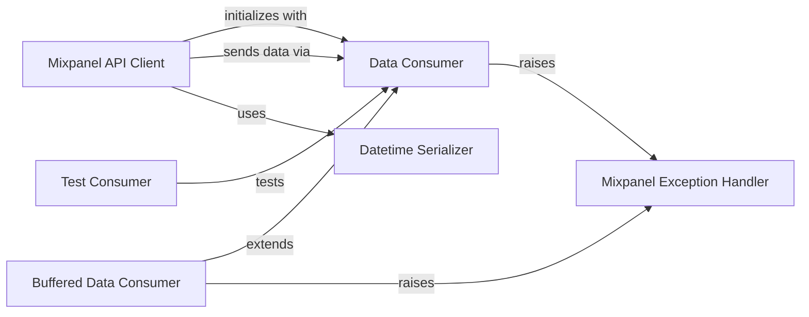

## Component Details

This graph illustrates the core components of the Mixpanel Python client library. The `Mixpanel API Client` serves as the primary interface for users to interact with the Mixpanel API, handling various data tracking and management operations. It relies on different `Data Consumer` implementations, such as the basic `Data Consumer` for direct HTTP requests and the `Buffered Data Consumer` for optimized batch sending, to transmit data. Error handling is centralized through the `Mixpanel Exception Handler`, while data formatting is managed by the `Datetime Serializer`. A dedicated `Test Consumer` component ensures the reliability and correctness of the data consumption process.

### Mixpanel API Client
The core client for interacting with the Mixpanel API. It provides methods for tracking events, importing historical data, managing user profiles (people), and managing group profiles. It relies on a Consumer to send data to Mixpanel and uses a Datetime Serializer for data formatting.

**Related Classes/Methods**:

- `mixpanel.Mixpanel` (full file reference)
- `mixpanel.Mixpanel:__init__` (full file reference)
- `mixpanel.Mixpanel:track` (full file reference)
- `mixpanel.Mixpanel:import_data` (full file reference)
- `mixpanel.Mixpanel:alias` (full file reference)
- `mixpanel.Mixpanel:merge` (full file reference)
- `mixpanel.Mixpanel:people_set` (full file reference)
- `mixpanel.Mixpanel:people_set_once` (full file reference)
- `mixpanel.Mixpanel:people_increment` (full file reference)
- `mixpanel.Mixpanel:people_append` (full file reference)
- `mixpanel.Mixpanel:people_union` (full file reference)
- `mixpanel.Mixpanel:people_unset` (full file reference)
- `mixpanel.Mixpanel:people_remove` (full file reference)
- `mixpanel.Mixpanel:people_delete` (full file reference)
- `mixpanel.Mixpanel:people_track_charge` (full file reference)
- `mixpanel.Mixpanel:people_clear_charges` (full file reference)
- `mixpanel.Mixpanel:people_update` (full file reference)
- `mixpanel.Mixpanel:group_set` (full file reference)
- `mixpanel.Mixpanel:group_set_once` (full file reference)
- `mixpanel.Mixpanel:group_union` (full file reference)
- `mixpanel.Mixpanel:group_unset` (full file reference)
- `mixpanel.Mixpanel:group_remove` (full file reference)
- `mixpanel.Mixpanel:group_delete` (full file reference)
- `mixpanel.Mixpanel:group_update` (full file reference)

### Data Consumer
Handles the actual sending of data to the Mixpanel API endpoints. It manages HTTP requests, retries, and error handling. It can be configured with different API hosts and timeouts.

**Related Classes/Methods**:

- `mixpanel.Consumer` (520:633)
- `mixpanel.Consumer:send` (577:594)
- `mixpanel.Consumer:_write_request` (596:633)

### Buffered Data Consumer
An extension of the Data Consumer that buffers messages before sending them in batches to Mixpanel. This can improve efficiency by reducing the number of HTTP requests. It requires explicit flushing to ensure all buffered messages are sent.

**Related Classes/Methods**:

- `mixpanel.BufferedConsumer` (full file reference)
- `mixpanel.BufferedConsumer:__init__` (full file reference)
- `mixpanel.BufferedConsumer:send` (full file reference)
- `mixpanel.BufferedConsumer:flush` (full file reference)
- `mixpanel.BufferedConsumer:_flush_endpoint` (full file reference)

### Mixpanel Exception Handler
A custom exception class used to signal errors encountered during the process of sending messages to Mixpanel, typically due to network issues, invalid endpoints, or server-side processing failures.

**Related Classes/Methods**:

- `mixpanel.MixpanelException` (full file reference)

### Test Consumer
A testing component responsible for verifying the functionality of the Mixpanel Consumer. It sets up test environments and executes various scenarios to ensure data is sent correctly and errors are handled as expected.

**Related Classes/Methods**:

- <a href="https://github.com/mixpanel/mixpanel-python/blob/master/test_mixpanel.py#L462-L578" target="_blank" rel="noopener noreferrer">`test_mixpanel.TestConsumer` (462:578)</a>
- <a href="https://github.com/mixpanel/mixpanel-python/blob/master/test_mixpanel.py#L464-L465" target="_blank" rel="noopener noreferrer">`test_mixpanel.TestConsumer:setup_class` (464:465)</a>
- <a href="https://github.com/mixpanel/mixpanel-python/blob/master/test_mixpanel.py#L467-L476" target="_blank" rel="noopener noreferrer">`test_mixpanel.TestConsumer:test_send_events` (467:476)</a>
- <a href="https://github.com/mixpanel/mixpanel-python/blob/master/test_mixpanel.py#L478-L487" target="_blank" rel="noopener noreferrer">`test_mixpanel.TestConsumer:test_send_people` (478:487)</a>
- <a href="https://github.com/mixpanel/mixpanel-python/blob/master/test_mixpanel.py#L489-L498" target="_blank" rel="noopener noreferrer">`test_mixpanel.TestConsumer:test_server_success` (489:498)</a>
- <a href="https://github.com/mixpanel/mixpanel-python/blob/master/test_mixpanel.py#L500-L513" target="_blank" rel="noopener noreferrer">`test_mixpanel.TestConsumer:test_server_invalid_data` (500:513)</a>
- <a href="https://github.com/mixpanel/mixpanel-python/blob/master/test_mixpanel.py#L515-L526" target="_blank" rel="noopener noreferrer">`test_mixpanel.TestConsumer:test_server_unauthorized` (515:526)</a>
- <a href="https://github.com/mixpanel/mixpanel-python/blob/master/test_mixpanel.py#L528-L539" target="_blank" rel="noopener noreferrer">`test_mixpanel.TestConsumer:test_server_forbidden` (528:539)</a>
- <a href="https://github.com/mixpanel/mixpanel-python/blob/master/test_mixpanel.py#L541-L551" target="_blank" rel="noopener noreferrer">`test_mixpanel.TestConsumer:test_server_5xx` (541:551)</a>
- <a href="https://github.com/mixpanel/mixpanel-python/blob/master/test_mixpanel.py#L553-L574" target="_blank" rel="noopener noreferrer">`test_mixpanel.TestConsumer:test_consumer_override_api_host` (553:574)</a>
- <a href="https://github.com/mixpanel/mixpanel-python/blob/master/test_mixpanel.py#L576-L578" target="_blank" rel="noopener noreferrer">`test_mixpanel.TestConsumer:test_unknown_endpoint` (576:578)</a>

### Datetime Serializer
Responsible for serializing datetime objects into a format suitable for the Mixpanel API.

**Related Classes/Methods**:

- `mixpanel.DatetimeSerializer` (full file reference)

### [FAQ](https://github.com/CodeBoarding/GeneratedOnBoardings/tree/main?tab=readme-ov-file#faq)