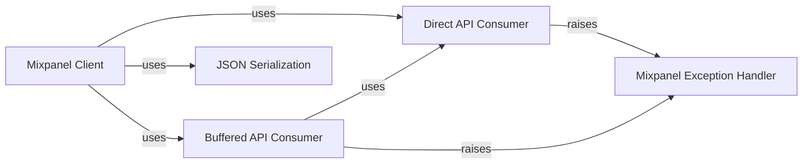

## Component Details

This system provides a comprehensive client for interacting with the Mixpanel API, enabling various analytics operations such as event tracking, user profile management (People Analytics), and group analytics. It abstracts the complexities of data preparation and transmission, offering both direct and buffered data consumption strategies to optimize API interactions. The system also includes robust error handling and specialized JSON serialization for Mixpanel-specific data types.

### Mixpanel Client
The primary interface for interacting with the Mixpanel API, enabling event tracking, user profile management (People Analytics), and group analytics. It orchestrates data preparation and delegates the actual data transmission to a configured data consumer.

**Related Classes/Methods**:

- <a href="https://github.com/mixpanel/mixpanel-python/blob/master/mixpanel/__init__.py#L50-L508" target="_blank" rel="noopener noreferrer">`mixpanel.__init__.Mixpanel` (50:508)</a>
- <a href="https://github.com/mixpanel/mixpanel-python/blob/master/mixpanel/__init__.py#L76-L105" target="_blank" rel="noopener noreferrer">`mixpanel.__init__.Mixpanel.track` (76:105)</a>
- <a href="https://github.com/mixpanel/mixpanel-python/blob/master/mixpanel/__init__.py#L107-L157" target="_blank" rel="noopener noreferrer">`mixpanel.__init__.Mixpanel.import_data` (107:157)</a>
- <a href="https://github.com/mixpanel/mixpanel-python/blob/master/mixpanel/__init__.py#L159-L189" target="_blank" rel="noopener noreferrer">`mixpanel.__init__.Mixpanel.alias` (159:189)</a>
- <a href="https://github.com/mixpanel/mixpanel-python/blob/master/mixpanel/__init__.py#L191-L227" target="_blank" rel="noopener noreferrer">`mixpanel.__init__.Mixpanel.merge` (191:227)</a>
- <a href="https://github.com/mixpanel/mixpanel-python/blob/master/mixpanel/__init__.py#L229-L241" target="_blank" rel="noopener noreferrer">`mixpanel.__init__.Mixpanel.people_set` (229:241)</a>
- <a href="https://github.com/mixpanel/mixpanel-python/blob/master/mixpanel/__init__.py#L243-L256" target="_blank" rel="noopener noreferrer">`mixpanel.__init__.Mixpanel.people_set_once` (243:256)</a>
- <a href="https://github.com/mixpanel/mixpanel-python/blob/master/mixpanel/__init__.py#L258-L272" target="_blank" rel="noopener noreferrer">`mixpanel.__init__.Mixpanel.people_increment` (258:272)</a>
- <a href="https://github.com/mixpanel/mixpanel-python/blob/master/mixpanel/__init__.py#L274-L289" target="_blank" rel="noopener noreferrer">`mixpanel.__init__.Mixpanel.people_append` (274:289)</a>
- <a href="https://github.com/mixpanel/mixpanel-python/blob/master/mixpanel/__init__.py#L291-L306" target="_blank" rel="noopener noreferrer">`mixpanel.__init__.Mixpanel.people_union` (291:306)</a>
- <a href="https://github.com/mixpanel/mixpanel-python/blob/master/mixpanel/__init__.py#L308-L317" target="_blank" rel="noopener noreferrer">`mixpanel.__init__.Mixpanel.people_unset` (308:317)</a>
- <a href="https://github.com/mixpanel/mixpanel-python/blob/master/mixpanel/__init__.py#L319-L333" target="_blank" rel="noopener noreferrer">`mixpanel.__init__.Mixpanel.people_remove` (319:333)</a>
- <a href="https://github.com/mixpanel/mixpanel-python/blob/master/mixpanel/__init__.py#L335-L343" target="_blank" rel="noopener noreferrer">`mixpanel.__init__.Mixpanel.people_delete` (335:343)</a>
- <a href="https://github.com/mixpanel/mixpanel-python/blob/master/mixpanel/__init__.py#L345-L362" target="_blank" rel="noopener noreferrer">`mixpanel.__init__.Mixpanel.people_track_charge` (345:362)</a>
- <a href="https://github.com/mixpanel/mixpanel-python/blob/master/mixpanel/__init__.py#L364-L371" target="_blank" rel="noopener noreferrer">`mixpanel.__init__.Mixpanel.people_clear_charges` (364:371)</a>
- <a href="https://github.com/mixpanel/mixpanel-python/blob/master/mixpanel/__init__.py#L373-L392" target="_blank" rel="noopener noreferrer">`mixpanel.__init__.Mixpanel.people_update` (373:392)</a>
- <a href="https://github.com/mixpanel/mixpanel-python/blob/master/mixpanel/__init__.py#L394-L408" target="_blank" rel="noopener noreferrer">`mixpanel.__init__.Mixpanel.group_set` (394:408)</a>
- <a href="https://github.com/mixpanel/mixpanel-python/blob/master/mixpanel/__init__.py#L410-L425" target="_blank" rel="noopener noreferrer">`mixpanel.__init__.Mixpanel.group_set_once` (410:425)</a>
- <a href="https://github.com/mixpanel/mixpanel-python/blob/master/mixpanel/__init__.py#L427-L444" target="_blank" rel="noopener noreferrer">`mixpanel.__init__.Mixpanel.group_union` (427:444)</a>
- <a href="https://github.com/mixpanel/mixpanel-python/blob/master/mixpanel/__init__.py#L446-L457" target="_blank" rel="noopener noreferrer">`mixpanel.__init__.Mixpanel.group_unset` (446:457)</a>
- <a href="https://github.com/mixpanel/mixpanel-python/blob/master/mixpanel/__init__.py#L459-L475" target="_blank" rel="noopener noreferrer">`mixpanel.__init__.Mixpanel.group_remove` (459:475)</a>
- <a href="https://github.com/mixpanel/mixpanel-python/blob/master/mixpanel/__init__.py#L477-L487" target="_blank" rel="noopener noreferrer">`mixpanel.__init__.Mixpanel.group_delete` (477:487)</a>
- <a href="https://github.com/mixpanel/mixpanel-python/blob/master/mixpanel/__init__.py#L489-L508" target="_blank" rel="noopener noreferrer">`mixpanel.__init__.Mixpanel.group_update` (489:508)</a>

### Direct API Consumer
This component is responsible for sending individual messages directly to the Mixpanel API via HTTP requests. It handles endpoint mapping, API key/secret authentication, and basic error handling for network issues or API responses.

**Related Classes/Methods**:

- `mixpanel.consumer.Consumer` (full file reference)
- `mixpanel.consumer.Consumer.send` (full file reference)
- `mixpanel.consumer.Consumer._write_request` (full file reference)

### Buffered API Consumer
This component extends the Consumer functionality by buffering multiple messages for a given endpoint and sending them in batches. This can improve efficiency by reducing the number of HTTP requests. It relies on the Consumer for the actual sending of batched data.

**Related Classes/Methods**:

- `mixpanel.buffered_consumer.BufferedConsumer` (full file reference)
- `mixpanel.buffered_consumer.BufferedConsumer.send` (full file reference)
- `mixpanel.buffered_consumer.BufferedConsumer.flush` (full file reference)
- `mixpanel.buffered_consumer.BufferedConsumer._flush_endpoint` (full file reference)

### Mixpanel Exception Handler
This custom exception class is raised by the consumers when there are issues sending messages to the Mixpanel API, such as network outages, unreachable servers, or invalid API responses.

**Related Classes/Methods**:

- `mixpanel.exceptions.MixpanelException` (full file reference)

### JSON Serialization
This component provides utilities for serializing Python objects, specifically datetime objects, into JSON format suitable for the Mixpanel API.

**Related Classes/Methods**:

- `mixpanel.json_util.DatetimeSerializer` (full file reference)
- `mixpanel.json_util.json_dumps` (full file reference)

### [FAQ](https://github.com/CodeBoarding/GeneratedOnBoardings/tree/main?tab=readme-ov-file#faq)