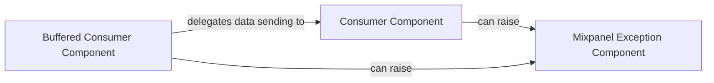

## Component Details

This graph illustrates the core components involved in sending data to Mixpanel and handling potential errors. The Consumer Component handles direct API communication, while the Buffered Consumer Component adds a buffering layer for efficiency. Both consumer components rely on and can raise exceptions defined by the Mixpanel Exception Component to signal various operational issues.

### Consumer Component
This component is responsible for directly sending data to the Mixpanel API. It handles the low-level details of making HTTP requests and managing potential exceptions during the data transmission process.

**Related Classes/Methods**:

- `mixpanel.Consumer` (520:609)
- `mixpanel.Consumer:send` (579:590)
- `mixpanel.Consumer:_write_request` (592:609)

### Buffered Consumer Component
This component extends the Consumer functionality by providing a buffering mechanism. It collects multiple data points before sending them in a batch to the Mixpanel API, which can improve efficiency and reduce API calls.

**Related Classes/Methods**:

- `mixpanel.BufferedConsumer` (612:680)
- `mixpanel.BufferedConsumer:send` (644:664)
- `mixpanel.BufferedConsumer:_flush_endpoint` (666:680)

### Mixpanel Exception Component
This component defines custom exception classes used throughout the Mixpanel library to signal specific errors related to API communication, invalid data, or internal operational failures.

**Related Classes/Methods**:

- `mixpanel.MixpanelException` (511:517)

### [FAQ](https://github.com/CodeBoarding/GeneratedOnBoardings/tree/main?tab=readme-ov-file#faq)