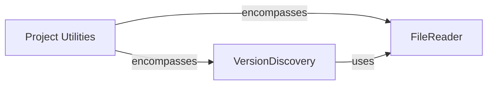

## Component Details

This subsystem manages the core setup and utility functions for the mixpanel-python library. It primarily handles reading file contents and discovering the project's version, which are crucial steps for the library's build and distribution processes. The main flow involves the 'Project Utilities' orchestrating the 'VersionDiscovery' and 'FileReader' components to ensure proper project configuration.

### Project Utilities
Manages project-level settings, including version discovery and setup processes, essential for building and distributing the library.

**Related Classes/Methods**:

- `mixpanel-python.setup` (full file reference)

### VersionDiscovery
This component is responsible for extracting the version string from a specified file, typically __init__.py, by reading its contents and applying a regular expression to find the __version__ variable. It raises a RuntimeError if the version string cannot be found.

**Related Classes/Methods**:

- <a href="https://github.com/mixpanel/mixpanel-python/blob/master/setup.py#L11-L16" target="_blank" rel="noopener noreferrer">`mixpanel-python.setup:find_version` (11:16)</a>

### FileReader
This component provides a utility function to read the content of a file given its path. It constructs the full file path, opens the file with UTF-8 encoding, and returns its entire content as a string.

**Related Classes/Methods**:

- <a href="https://github.com/mixpanel/mixpanel-python/blob/master/setup.py#L6-L9" target="_blank" rel="noopener noreferrer">`mixpanel-python.setup.read` (6:9)</a>

### [FAQ](https://github.com/CodeBoarding/GeneratedOnBoardings/tree/main?tab=readme-ov-file#faq)