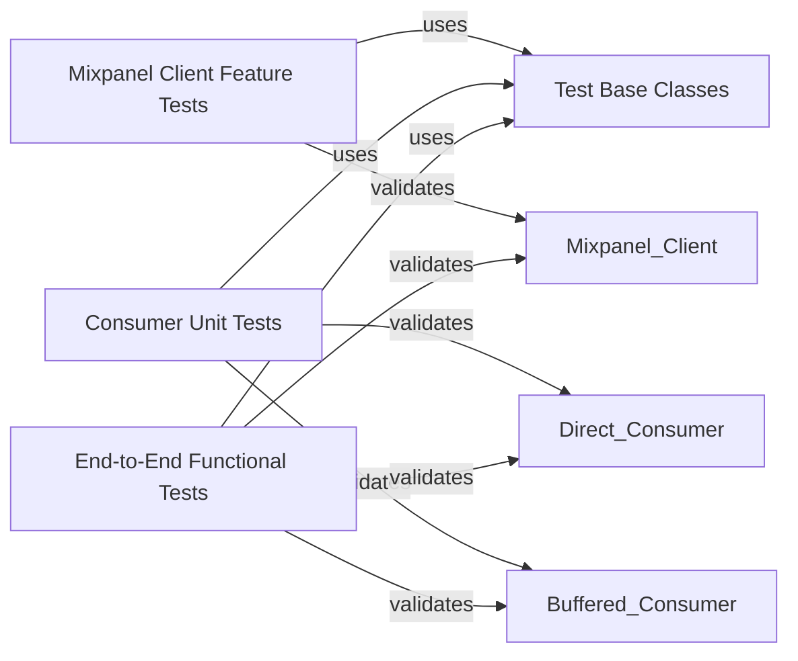

## Component Details

This graph details the internal structure and interactions of the `Testing Framework` component within the `mixpanel-python` project. Its main purpose is to ensure the correctness and robustness of the Mixpanel client and its data consumers through a comprehensive suite of unit and functional tests.

### Test Base Classes
Provides foundational classes and utilities for setting up and tearing down test environments, including a mock consumer for capturing sent data, used by other test components.

**Related Classes/Methods**:

- <a href="https://github.com/mixpanel/mixpanel-python/blob/master/test_mixpanel.py#L33-L40" target="_blank" rel="noopener noreferrer">`mixpanel-python.test_mixpanel.TestMixpanelBase` (33:40)</a>
- <a href="https://github.com/mixpanel/mixpanel-python/blob/master/test_mixpanel.py#L36-L40" target="_blank" rel="noopener noreferrer">`mixpanel-python.test_mixpanel.TestMixpanelBase:setup_method` (36:40)</a>
- <a href="https://github.com/mixpanel/mixpanel-python/blob/master/test_mixpanel.py#L16-L30" target="_blank" rel="noopener noreferrer">`mixpanel-python.test_mixpanel.LogConsumer` (16:30)</a>
- <a href="https://github.com/mixpanel/mixpanel-python/blob/master/test_mixpanel.py#L29-L30" target="_blank" rel="noopener noreferrer">`mixpanel-python.test_mixpanel.LogConsumer.clear` (29:30)</a>

### Mixpanel Client Feature Tests
Contains unit tests for various features of the `Mixpanel Client`, including event tracking, people profile updates, identity management (alias, merge), and group profile operations.

**Related Classes/Methods**:

- <a href="https://github.com/mixpanel/mixpanel-python/blob/master/test_mixpanel.py#L43-L126" target="_blank" rel="noopener noreferrer">`mixpanel-python.test_mixpanel.TestMixpanelTracking` (43:126)</a>
- <a href="https://github.com/mixpanel/mixpanel-python/blob/master/test_mixpanel.py#L45-L61" target="_blank" rel="noopener noreferrer">`mixpanel-python.test_mixpanel.TestMixpanelTracking:test_track` (45:61)</a>
- <a href="https://github.com/mixpanel/mixpanel-python/blob/master/test_mixpanel.py#L63-L68" target="_blank" rel="noopener noreferrer">`mixpanel-python.test_mixpanel.TestMixpanelTracking:test_track_makes_insert_id` (63:68)</a>
- <a href="https://github.com/mixpanel/mixpanel-python/blob/master/test_mixpanel.py#L70-L84" target="_blank" rel="noopener noreferrer">`mixpanel-python.test_mixpanel.TestMixpanelTracking:test_track_empty` (70:84)</a>
- <a href="https://github.com/mixpanel/mixpanel-python/blob/master/test_mixpanel.py#L86-L106" target="_blank" rel="noopener noreferrer">`mixpanel-python.test_mixpanel.TestMixpanelTracking:test_import_data` (86:106)</a>
- <a href="https://github.com/mixpanel/mixpanel-python/blob/master/test_mixpanel.py#L108-L126" target="_blank" rel="noopener noreferrer">`mixpanel-python.test_mixpanel.TestMixpanelTracking:test_track_meta` (108:126)</a>
- <a href="https://github.com/mixpanel/mixpanel-python/blob/master/test_mixpanel.py#L129-L308" target="_blank" rel="noopener noreferrer">`mixpanel-python.test_mixpanel.TestMixpanelPeople` (129:308)</a>
- <a href="https://github.com/mixpanel/mixpanel-python/blob/master/test_mixpanel.py#L131-L143" target="_blank" rel="noopener noreferrer">`mixpanel-python.test_mixpanel.TestMixpanelPeople:test_people_set` (131:143)</a>
- <a href="https://github.com/mixpanel/mixpanel-python/blob/master/test_mixpanel.py#L145-L157" target="_blank" rel="noopener noreferrer">`mixpanel-python.test_mixpanel.TestMixpanelPeople:test_people_set_once` (145:157)</a>
- <a href="https://github.com/mixpanel/mixpanel-python/blob/master/test_mixpanel.py#L159-L170" target="_blank" rel="noopener noreferrer">`mixpanel-python.test_mixpanel.TestMixpanelPeople:test_people_increment` (159:170)</a>
- <a href="https://github.com/mixpanel/mixpanel-python/blob/master/test_mixpanel.py#L172-L184" target="_blank" rel="noopener noreferrer">`mixpanel-python.test_mixpanel.TestMixpanelPeople:test_people_append` (172:184)</a>
- <a href="https://github.com/mixpanel/mixpanel-python/blob/master/test_mixpanel.py#L186-L197" target="_blank" rel="noopener noreferrer">`mixpanel-python.test_mixpanel.TestMixpanelPeople:test_people_union` (186:197)</a>
- <a href="https://github.com/mixpanel/mixpanel-python/blob/master/test_mixpanel.py#L199-L208" target="_blank" rel="noopener noreferrer">`mixpanel-python.test_mixpanel.TestMixpanelPeople:test_people_unset` (199:208)</a>
- <a href="https://github.com/mixpanel/mixpanel-python/blob/master/test_mixpanel.py#L210-L219" target="_blank" rel="noopener noreferrer">`mixpanel-python.test_mixpanel.TestMixpanelPeople:test_people_remove` (210:219)</a>
- <a href="https://github.com/mixpanel/mixpanel-python/blob/master/test_mixpanel.py#L221-L235" target="_blank" rel="noopener noreferrer">`mixpanel-python.test_mixpanel.TestMixpanelPeople:test_people_track_charge` (221:235)</a>
- <a href="https://github.com/mixpanel/mixpanel-python/blob/master/test_mixpanel.py#L237-L250" target="_blank" rel="noopener noreferrer">`mixpanel-python.test_mixpanel.TestMixpanelPeople:test_people_track_charge_without_properties` (237:250)</a>
- <a href="https://github.com/mixpanel/mixpanel-python/blob/master/test_mixpanel.py#L252-L261" target="_blank" rel="noopener noreferrer">`mixpanel-python.test_mixpanel.TestMixpanelPeople:test_people_clear_charges` (252:261)</a>
- <a href="https://github.com/mixpanel/mixpanel-python/blob/master/test_mixpanel.py#L263-L276" target="_blank" rel="noopener noreferrer">`mixpanel-python.test_mixpanel.TestMixpanelPeople:test_people_set_created_date_string` (263:276)</a>
- <a href="https://github.com/mixpanel/mixpanel-python/blob/master/test_mixpanel.py#L278-L291" target="_blank" rel="noopener noreferrer">`mixpanel-python.test_mixpanel.TestMixpanelPeople:test_people_set_created_date_datetime` (278:291)</a>
- <a href="https://github.com/mixpanel/mixpanel-python/blob/master/test_mixpanel.py#L293-L308" target="_blank" rel="noopener noreferrer">`mixpanel-python.test_mixpanel.TestMixpanelPeople:test_people_meta` (293:308)</a>
- <a href="https://github.com/mixpanel/mixpanel-python/blob/master/test_mixpanel.py#L311-L360" target="_blank" rel="noopener noreferrer">`mixpanel-python.test_mixpanel.TestMixpanelIdentity` (311:360)</a>
- <a href="https://github.com/mixpanel/mixpanel-python/blob/master/test_mixpanel.py#L313-L331" target="_blank" rel="noopener noreferrer">`mixpanel-python.test_mixpanel.TestMixpanelIdentity:test_alias` (313:331)</a>
- <a href="https://github.com/mixpanel/mixpanel-python/blob/master/test_mixpanel.py#L333-L360" target="_blank" rel="noopener noreferrer">`mixpanel-python.test_mixpanel.TestMixpanelIdentity:test_merge` (333:360)</a>
- <a href="https://github.com/mixpanel/mixpanel-python/blob/master/test_mixpanel.py#L363-L459" target="_blank" rel="noopener noreferrer">`mixpanel-python.test_mixpanel.TestMixpanelGroups` (363:459)</a>
- <a href="https://github.com/mixpanel/mixpanel-python/blob/master/test_mixpanel.py#L365-L378" target="_blank" rel="noopener noreferrer">`mixpanel-python.test_mixpanel.TestMixpanelGroups:test_group_set` (365:378)</a>
- <a href="https://github.com/mixpanel/mixpanel-python/blob/master/test_mixpanel.py#L380-L393" target="_blank" rel="noopener noreferrer">`mixpanel-python.test_mixpanel.TestMixpanelGroups:test_group_set_once` (380:393)</a>
- <a href="https://github.com/mixpanel/mixpanel-python/blob/master/test_mixpanel.py#L395-L407" target="_blank" rel="noopener noreferrer">`mixpanel-python.test_mixpanel.TestMixpanelGroups:test_group_union` (395:407)</a>
- <a href="https://github.com/mixpanel/mixpanel-python/blob/master/test_mixpanel.py#L409-L419" target="_blank" rel="noopener noreferrer">`mixpanel-python.test_mixpanel.TestMixpanelGroups:test_group_unset` (409:419)</a>
- <a href="https://github.com/mixpanel/mixpanel-python/blob/master/test_mixpanel.py#L421-L431" target="_blank" rel="noopener noreferrer">`mixpanel-python.test_mixpanel.TestMixpanelGroups:test_group_remove` (421:431)</a>
- <a href="https://github.com/mixpanel/mixpanel-python/blob/master/test_mixpanel.py#L433-L459" target="_blank" rel="noopener noreferrer">`mixpanel-python.test_mixpanel.TestMixpanelGroups:test_custom_json_serializer` (433:459)</a>

### Consumer Unit Tests
Focuses on validating the behavior of the `Direct Consumer` and `Buffered Consumer` components, including data sending, buffering logic, and error handling for API interactions.

**Related Classes/Methods**:

- <a href="https://github.com/mixpanel/mixpanel-python/blob/master/test_mixpanel.py#L462-L578" target="_blank" rel="noopener noreferrer">`mixpanel-python.test_mixpanel.TestConsumer` (462:578)</a>
- <a href="https://github.com/mixpanel/mixpanel-python/blob/master/test_mixpanel.py#L464-L465" target="_blank" rel="noopener noreferrer">`mixpanel-python.test_mixpanel.TestConsumer:setup_class` (464:465)</a>
- <a href="https://github.com/mixpanel/mixpanel-python/blob/master/test_mixpanel.py#L467-L476" target="_blank" rel="noopener noreferrer">`mixpanel-python.test_mixpanel.TestConsumer:test_send_events` (467:476)</a>
- <a href="https://github.com/mixpanel/mixpanel-python/blob/master/test_mixpanel.py#L478-L487" target="_blank" rel="noopener noreferrer">`mixpanel-python.test_mixpanel.TestConsumer:test_send_people` (478:487)</a>
- <a href="https://github.com/mixpanel/mixpanel-python/blob/master/test_mixpanel.py#L489-L498" target="_blank" rel="noopener noreferrer">`mixpanel-python.test_mixpanel.TestConsumer:test_server_success` (489:498)</a>
- <a href="https://github.com/mixpanel/mixpanel-python/blob/master/test_mixpanel.py#L500-L513" target="_blank" rel="noopener noreferrer">`mixpanel-python.test_mixpanel.TestConsumer:test_server_invalid_data` (500:513)</a>
- <a href="https://github.com/mixpanel/mixpanel-python/blob/master/test_mixpanel.py#L515-L526" target="_blank" rel="noopener noreferrer">`mixpanel-python.test_mixpanel.TestConsumer:test_server_unauthorized` (515:526)</a>
- <a href="https://github.com/mixpanel/mixpanel-python/blob/master/test_mixpanel.py#L528-L539" target="_blank" rel="noopener noreferrer">`mixpanel-python.test_mixpanel.TestConsumer:test_server_forbidden` (528:539)</a>
- <a href="https://github.com/mixpanel/mixpanel-python/blob/master/test_mixpanel.py#L541-L551" target="_blank" rel="noopener noreferrer">`mixpanel-python.test_mixpanel.TestConsumer:test_server_5xx` (541:551)</a>
- <a href="https://github.com/mixpanel/mixpanel-python/blob/master/test_mixpanel.py#L553-L574" target="_blank" rel="noopener noreferrer">`mixpanel-python.test_mixpanel.TestConsumer:test_consumer_override_api_host` (553:574)</a>
- <a href="https://github.com/mixpanel/mixpanel-python/blob/master/test_mixpanel.py#L576-L578" target="_blank" rel="noopener noreferrer">`mixpanel-python.test_mixpanel.TestConsumer:test_unknown_endpoint` (576:578)</a>
- <a href="https://github.com/mixpanel/mixpanel-python/blob/master/test_mixpanel.py#L581-L643" target="_blank" rel="noopener noreferrer">`mixpanel-python.test_mixpanel.TestBufferedConsumer` (581:643)</a>
- <a href="https://github.com/mixpanel/mixpanel-python/blob/master/test_mixpanel.py#L583-L587" target="_blank" rel="noopener noreferrer">`mixpanel-python.test_mixpanel.TestBufferedConsumer:setup_class` (583:587)</a>
- <a href="https://github.com/mixpanel/mixpanel-python/blob/master/test_mixpanel.py#L592-L596" target="_blank" rel="noopener noreferrer">`mixpanel-python.test_mixpanel.TestBufferedConsumer:test_buffer_hold_and_flush` (592:596)</a>
- <a href="https://github.com/mixpanel/mixpanel-python/blob/master/test_mixpanel.py#L598-L608" target="_blank" rel="noopener noreferrer">`mixpanel-python.test_mixpanel.TestBufferedConsumer:test_buffer_fills_up` (598:608)</a>
- <a href="https://github.com/mixpanel/mixpanel-python/blob/master/test_mixpanel.py#L610-L613" target="_blank" rel="noopener noreferrer">`mixpanel-python.test_mixpanel.TestBufferedConsumer:test_unknown_endpoint_raises_on_send` (610:613)</a>
- <a href="https://github.com/mixpanel/mixpanel-python/blob/master/test_mixpanel.py#L615-L631" target="_blank" rel="noopener noreferrer">`mixpanel-python.test_mixpanel.TestBufferedConsumer:test_useful_reraise_in_flush_endpoint` (615:631)</a>
- <a href="https://github.com/mixpanel/mixpanel-python/blob/master/test_mixpanel.py#L633-L637" target="_blank" rel="noopener noreferrer">`mixpanel-python.test_mixpanel.TestBufferedConsumer:test_send_remembers_api_key` (633:637)</a>
- <a href="https://github.com/mixpanel/mixpanel-python/blob/master/test_mixpanel.py#L639-L643" target="_blank" rel="noopener noreferrer">`mixpanel-python.test_mixpanel.TestBufferedConsumer:test_send_remembers_api_secret` (639:643)</a>

### End-to-End Functional Tests
Provides higher-level functional tests to ensure the complete data flow from the Mixpanel client through the consumers to a simulated Mixpanel API endpoint works as expected.

**Related Classes/Methods**:

- <a href="https://github.com/mixpanel/mixpanel-python/blob/master/test_mixpanel.py#L648-L692" target="_blank" rel="noopener noreferrer">`mixpanel-python.test_mixpanel.TestFunctional` (648:692)</a>
- <a href="https://github.com/mixpanel/mixpanel-python/blob/master/test_mixpanel.py#L650-L653" target="_blank" rel="noopener noreferrer">`mixpanel-python.test_mixpanel.TestFunctional:setup_class` (650:653)</a>
- <a href="https://github.com/mixpanel/mixpanel-python/blob/master/test_mixpanel.py#L655-L673" target="_blank" rel="noopener noreferrer">`mixpanel-python.test_mixpanel.TestFunctional:test_track_functional` (655:673)</a>
- <a href="https://github.com/mixpanel/mixpanel-python/blob/master/test_mixpanel.py#L675-L692" target="_blank" rel="noopener noreferrer">`mixpanel-python.test_mixpanel.TestFunctional:test_people_set_functional` (675:692)</a>

### [FAQ](https://github.com/CodeBoarding/GeneratedOnBoardings/tree/main?tab=readme-ov-file#faq)