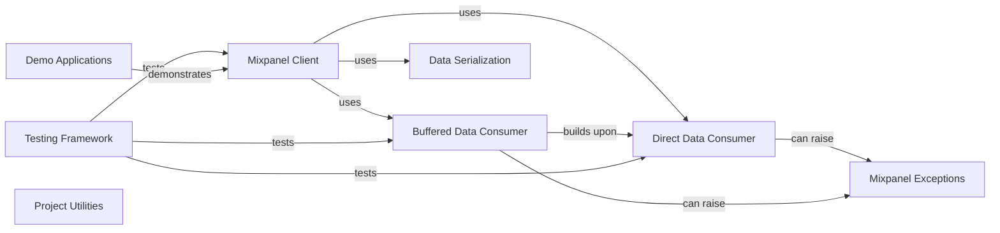

## Component Details

This architecture describes the `mixpanel-python` library, which provides a Python interface for interacting with the Mixpanel analytics API. The core functionality revolves around the `Mixpanel Client` for tracking events and managing user/group profiles, which delegates data transmission to various `Data Consumers`. Data is prepared using `Data Serialization` utilities, and potential issues are handled by `Mixpanel Exceptions`. The robustness of the library is ensured by a comprehensive `Testing Framework`, while `Demo Applications` provide practical usage examples. `Project Utilities` manage the library's setup and versioning.

### Mixpanel Client
The primary interface for interacting with the Mixpanel API, enabling event tracking, user profile management (People Analytics), and group analytics. It orchestrates data preparation and delegates the actual data transmission to a configured data consumer.

**Related Classes/Methods**:

- <a href="https://github.com/mixpanel/mixpanel-python/blob/master/mixpanel/__init__.py#L50-L508" target="_blank" rel="noopener noreferrer">`mixpanel.__init__.Mixpanel` (50:508)</a>
- <a href="https://github.com/mixpanel/mixpanel-python/blob/master/mixpanel/__init__.py#L76-L105" target="_blank" rel="noopener noreferrer">`mixpanel.__init__.Mixpanel.track` (76:105)</a>
- <a href="https://github.com/mixpanel/mixpanel-python/blob/master/mixpanel/__init__.py#L107-L157" target="_blank" rel="noopener noreferrer">`mixpanel.__init__.Mixpanel.import_data` (107:157)</a>
- <a href="https://github.com/mixpanel/mixpanel-python/blob/master/mixpanel/__init__.py#L159-L189" target="_blank" rel="noopener noreferrer">`mixpanel.__init__.Mixpanel.alias` (159:189)</a>
- <a href="https://github.com/mixpanel/mixpanel-python/blob/master/mixpanel/__init__.py#L191-L227" target="_blank" rel="noopener noreferrer">`mixpanel.__init__.Mixpanel.merge` (191:227)</a>
- <a href="https://github.com/mixpanel/mixpanel-python/blob/master/mixpanel/__init__.py#L229-L241" target="_blank" rel="noopener noreferrer">`mixpanel.__init__.Mixpanel.people_set` (229:241)</a>
- <a href="https://github.com/mixpanel/mixpanel-python/blob/master/mixpanel/__init__.py#L243-L256" target="_blank" rel="noopener noreferrer">`mixpanel.__init__.Mixpanel.people_set_once` (243:256)</a>
- <a href="https://github.com/mixpanel/mixpanel-python/blob/master/mixpanel/__init__.py#L258-L272" target="_blank" rel="noopener noreferrer">`mixpanel.__init__.Mixpanel.people_increment` (258:272)</a>
- <a href="https://github.com/mixpanel/mixpanel-python/blob/master/mixpanel/__init__.py#L274-L289" target="_blank" rel="noopener noreferrer">`mixpanel.__init__.Mixpanel.people_append` (274:289)</a>
- <a href="https://github.com/mixpanel/mixpanel-python/blob/master/mixpanel/__init__.py#L291-L306" target="_blank" rel="noopener noreferrer">`mixpanel.__init__.Mixpanel.people_union` (291:306)</a>
- <a href="https://github.com/mixpanel/mixpanel-python/blob/master/mixpanel/__init__.py#L308-L317" target="_blank" rel="noopener noreferrer">`mixpanel.__init__.Mixpanel.people_unset` (308:317)</a>
- <a href="https://github.com/mixpanel/mixpanel-python/blob/master/mixpanel/__init__.py#L319-L333" target="_blank" rel="noopener noreferrer">`mixpanel.__init__.Mixpanel.people_remove` (319:333)</a>
- <a href="https://github.com/mixpanel/mixpanel-python/blob/master/mixpanel/__init__.py#L335-L343" target="_blank" rel="noopener noreferrer">`mixpanel.__init__.Mixpanel.people_delete` (335:343)</a>
- <a href="https://github.com/mixpanel/mixpanel-python/blob/master/mixpanel/__init__.py#L345-L362" target="_blank" rel="noopener noreferrer">`mixpanel.__init__.Mixpanel.people_track_charge` (345:362)</a>
- <a href="https://github.com/mixpanel/mixpanel-python/blob/master/mixpanel/__init__.py#L364-L371" target="_blank" rel="noopener noreferrer">`mixpanel.__init__.Mixpanel.people_clear_charges` (364:371)</a>
- <a href="https://github.com/mixpanel/mixpanel-python/blob/master/mixpanel/__init__.py#L373-L392" target="_blank" rel="noopener noreferrer">`mixpanel.__init__.Mixpanel.people_update` (373:392)</a>
- <a href="https://github.com/mixpanel/mixpanel-python/blob/master/mixpanel/__init__.py#L394-L408" target="_blank" rel="noopener noreferrer">`mixpanel.__init__.Mixpanel.group_set` (394:408)</a>
- <a href="https://github.com/mixpanel/mixpanel-python/blob/master/mixpanel/__init__.py#L410-L425" target="_blank" rel="noopener noreferrer">`mixpanel.__init__.Mixpanel.group_set_once` (410:425)</a>
- <a href="https://github.com/mixpanel/mixpanel-python/blob/master/mixpanel/__init__.py#L427-L444" target="_blank" rel="noopener noreferrer">`mixpanel.__init__.Mixpanel.group_union` (427:444)</a>
- <a href="https://github.com/mixpanel/mixpanel-python/blob/master/mixpanel/__init__.py#L446-L457" target="_blank" rel="noopener noreferrer">`mixpanel.__init__.Mixpanel.group_unset` (446:457)</a>
- <a href="https://github.com/mixpanel/mixpanel-python/blob/master/mixpanel/__init__.py#L459-L475" target="_blank" rel="noopener noreferrer">`mixpanel.__init__.Mixpanel.group_remove` (459:475)</a>
- <a href="https://github.com/mixpanel/mixpanel-python/blob/master/mixpanel/__init__.py#L477-L487" target="_blank" rel="noopener noreferrer">`mixpanel.__init__.Mixpanel.group_delete` (477:487)</a>
- <a href="https://github.com/mixpanel/mixpanel-python/blob/master/mixpanel/__init__.py#L489-L508" target="_blank" rel="noopener noreferrer">`mixpanel.__init__.Mixpanel.group_update` (489:508)</a>

### Direct Data Consumer
Responsible for immediately sending data to the Mixpanel API via HTTP requests. It handles network communication, API endpoint configuration, and basic error handling for server responses.

**Related Classes/Methods**:

- <a href="https://github.com/mixpanel/mixpanel-python/blob/master/mixpanel/__init__.py#L520-L633" target="_blank" rel="noopener noreferrer">`mixpanel.__init__.Consumer` (520:633)</a>
- <a href="https://github.com/mixpanel/mixpanel-python/blob/master/mixpanel/__init__.py#L577-L594" target="_blank" rel="noopener noreferrer">`mixpanel.__init__.Consumer.send` (577:594)</a>
- <a href="https://github.com/mixpanel/mixpanel-python/blob/master/mixpanel/__init__.py#L596-L633" target="_blank" rel="noopener noreferrer">`mixpanel.__init__.Consumer._write_request` (596:633)</a>

### Buffered Data Consumer
Extends the Direct Data Consumer by providing a mechanism to buffer multiple messages and send them in batches. This optimizes network usage by reducing the number of individual HTTP requests, and requires explicit flushing to ensure all data is sent.

**Related Classes/Methods**:

- <a href="https://github.com/mixpanel/mixpanel-python/blob/master/mixpanel/__init__.py#L636-L738" target="_blank" rel="noopener noreferrer">`mixpanel.__init__.BufferedConsumer` (636:738)</a>
- <a href="https://github.com/mixpanel/mixpanel-python/blob/master/mixpanel/__init__.py#L682-L713" target="_blank" rel="noopener noreferrer">`mixpanel.__init__.BufferedConsumer.send` (682:713)</a>
- <a href="https://github.com/mixpanel/mixpanel-python/blob/master/mixpanel/__init__.py#L715-L722" target="_blank" rel="noopener noreferrer">`mixpanel.__init__.BufferedConsumer.flush` (715:722)</a>
- <a href="https://github.com/mixpanel/mixpanel-python/blob/master/mixpanel/__init__.py#L724-L738" target="_blank" rel="noopener noreferrer">`mixpanel.__init__.BufferedConsumer._flush_endpoint` (724:738)</a>

### Data Serialization
Provides utilities for serializing Python objects, specifically `datetime` objects, into a JSON format suitable for the Mixpanel API.

**Related Classes/Methods**:

- <a href="https://github.com/mixpanel/mixpanel-python/blob/master/mixpanel/__init__.py#L36-L42" target="_blank" rel="noopener noreferrer">`mixpanel.__init__.DatetimeSerializer` (36:42)</a>
- <a href="https://github.com/mixpanel/mixpanel-python/blob/master/mixpanel/__init__.py#L45-L47" target="_blank" rel="noopener noreferrer">`mixpanel.__init__.json_dumps` (45:47)</a>

### Mixpanel Exceptions
Defines custom exception classes used throughout the Mixpanel library to signal specific errors related to API communication, invalid data, or internal operational failures.

**Related Classes/Methods**:

- <a href="https://github.com/mixpanel/mixpanel-python/blob/master/mixpanel/__init__.py#L511-L517" target="_blank" rel="noopener noreferrer">`mixpanel.__init__.MixpanelException` (511:517)</a>

### Testing Framework
A comprehensive suite of unit and functional tests designed to validate the correctness and robustness of the Mixpanel client, its data consumers, and various API interactions.

**Related Classes/Methods**:

- <a href="https://github.com/mixpanel/mixpanel-python/blob/master/test_mixpanel.py#L33-L40" target="_blank" rel="noopener noreferrer">`mixpanel-python.test_mixpanel.TestMixpanelBase` (33:40)</a>
- <a href="https://github.com/mixpanel/mixpanel-python/blob/master/test_mixpanel.py#L36-L40" target="_blank" rel="noopener noreferrer">`mixpanel-python.test_mixpanel.TestMixpanelBase:setup_method` (36:40)</a>
- <a href="https://github.com/mixpanel/mixpanel-python/blob/master/test_mixpanel.py#L16-L30" target="_blank" rel="noopener noreferrer">`mixpanel-python.test_mixpanel.LogConsumer` (16:30)</a>
- <a href="https://github.com/mixpanel/mixpanel-python/blob/master/test_mixpanel.py#L29-L30" target="_blank" rel="noopener noreferrer">`mixpanel-python.test_mixpanel.LogConsumer.clear` (29:30)</a>
- <a href="https://github.com/mixpanel/mixpanel-python/blob/master/test_mixpanel.py#L43-L126" target="_blank" rel="noopener noreferrer">`mixpanel-python.test_mixpanel.TestMixpanelTracking` (43:126)</a>
- <a href="https://github.com/mixpanel/mixpanel-python/blob/master/test_mixpanel.py#L45-L61" target="_blank" rel="noopener noreferrer">`mixpanel-python.test_mixpanel.TestMixpanelTracking:test_track` (45:61)</a>
- <a href="https://github.com/mixpanel/mixpanel-python/blob/master/test_mixpanel.py#L63-L68" target="_blank" rel="noopener noreferrer">`mixpanel-python.test_mixpanel.TestMixpanelTracking:test_track_makes_insert_id` (63:68)</a>
- <a href="https://github.com/mixpanel/mixpanel-python/blob/master/test_mixpanel.py#L70-L84" target="_blank" rel="noopener noreferrer">`mixpanel-python.test_mixpanel.TestMixpanelTracking:test_track_empty` (70:84)</a>
- <a href="https://github.com/mixpanel/mixpanel-python/blob/master/test_mixpanel.py#L86-L106" target="_blank" rel="noopener noreferrer">`mixpanel-python.test_mixpanel.TestMixpanelTracking:test_import_data` (86:106)</a>
- <a href="https://github.com/mixpanel/mixpanel-python/blob/master/test_mixpanel.py#L108-L126" target="_blank" rel="noopener noreferrer">`mixpanel-python.test_mixpanel.TestMixpanelTracking:test_track_meta` (108:126)</a>
- <a href="https://github.com/mixpanel/mixpanel-python/blob/master/test_mixpanel.py#L129-L308" target="_blank" rel="noopener noreferrer">`mixpanel-python.test_mixpanel.TestMixpanelPeople` (129:308)</a>
- <a href="https://github.com/mixpanel/mixpanel-python/blob/master/test_mixpanel.py#L131-L143" target="_blank" rel="noopener noreferrer">`mixpanel-python.test_mixpanel.TestMixpanelPeople:test_people_set` (131:143)</a>
- <a href="https://github.com/mixpanel/mixpanel-python/blob/master/test_mixpanel.py#L145-L157" target="_blank" rel="noopener noreferrer">`mixpanel-python.test_mixpanel.TestMixpanelPeople:test_people_set_once` (145:157)</a>
- <a href="https://github.com/mixpanel/mixpanel-python/blob/master/test_mixpanel.py#L159-L170" target="_blank" rel="noopener noreferrer">`mixpanel-python.test_mixpanel.TestMixpanelPeople:test_people_increment` (159:170)</a>
- <a href="https://github.com/mixpanel/mixpanel-python/blob/master/test_mixpanel.py#L172-L184" target="_blank" rel="noopener noreferrer">`mixpanel-python.test_mixpanel.TestMixpanelPeople:test_people_append` (172:184)</a>
- <a href="https://github.com/mixpanel/mixpanel-python/blob/master/test_mixpanel.py#L186-L197" target="_blank" rel="noopener noreferrer">`mixpanel-python.test_mixpanel.TestMixpanelPeople:test_people_union` (186:197)</a>
- <a href="https://github.com/mixpanel/mixpanel-python/blob/master/test_mixpanel.py#L199-L208" target="_blank" rel="noopener noreferrer">`mixpanel-python.test_mixpanel.TestMixpanelPeople:test_people_unset` (199:208)</a>
- <a href="https://github.com/mixpanel/mixpanel-python/blob/master/test_mixpanel.py#L210-L219" target="_blank" rel="noopener noreferrer">`mixpanel-python.test_mixpanel.TestMixpanelPeople:test_people_remove` (210:219)</a>
- <a href="https://github.com/mixpanel/mixpanel-python/blob/master/test_mixpanel.py#L221-L235" target="_blank" rel="noopener noreferrer">`mixpanel-python.test_mixpanel.TestMixpanelPeople:test_people_track_charge` (221:235)</a>
- <a href="https://github.com/mixpanel/mixpanel-python/blob/master/test_mixpanel.py#L237-L250" target="_blank" rel="noopener noreferrer">`mixpanel-python.test_mixpanel.TestMixpanelPeople:test_people_track_charge_without_properties` (237:250)</a>
- <a href="https://github.com/mixpanel/mixpanel-python/blob/master/test_mixpanel.py#L252-L261" target="_blank" rel="noopener noreferrer">`mixpanel-python.test_mixpanel.TestMixpanelPeople:test_people_clear_charges` (252:261)</a>
- <a href="https://github.com/mixpanel/mixpanel-python/blob/master/test_mixpanel.py#L263-L276" target="_blank" rel="noopener noreferrer">`mixpanel-python.test_mixpanel.TestMixpanelPeople:test_people_set_created_date_string` (263:276)</a>
- <a href="https://github.com/mixpanel/mixpanel-python/blob/master/test_mixpanel.py#L278-L291" target="_blank" rel="noopener noreferrer">`mixpanel-python.test_mixpanel.TestMixpanelPeople:test_people_set_created_date_datetime` (278:291)</a>
- <a href="https://github.com/mixpanel/mixpanel-python/blob/master/test_mixpanel.py#L293-L308" target="_blank" rel="noopener noreferrer">`mixpanel-python.test_mixpanel.TestMixpanelPeople:test_people_meta` (293:308)</a>
- <a href="https://github.com/mixpanel/mixpanel-python/blob/master/test_mixpanel.py#L311-L360" target="_blank" rel="noopener noreferrer">`mixpanel-python.test_mixpanel.TestMixpanelIdentity` (311:360)</a>
- <a href="https://github.com/mixpanel/mixpanel-python/blob/master/test_mixpanel.py#L313-L331" target="_blank" rel="noopener noreferrer">`mixpanel-python.test_mixpanel.TestMixpanelIdentity:test_alias` (313:331)</a>
- <a href="https://github.com/mixpanel/mixpanel-python/blob/master/test_mixpanel.py#L333-L360" target="_blank" rel="noopener noreferrer">`mixpanel-python.test_mixpanel.TestMixpanelIdentity:test_merge` (333:360)</a>
- <a href="https://github.com/mixpanel/mixpanel-python/blob/master/test_mixpanel.py#L363-L459" target="_blank" rel="noopener noreferrer">`mixpanel-python.test_mixpanel.TestMixpanelGroups` (363:459)</a>
- <a href="https://github.com/mixpanel/mixpanel-python/blob/master/test_mixpanel.py#L365-L378" target="_blank" rel="noopener noreferrer">`mixpanel-python.test_mixpanel.TestMixpanelGroups:test_group_set` (365:378)</a>
- <a href="https://github.com/mixpanel/mixpanel-python/blob/master/test_mixpanel.py#L380-L393" target="_blank" rel="noopener noreferrer">`mixpanel-python.test_mixpanel.TestMixpanelGroups:test_group_set_once` (380:393)</a>
- <a href="https://github.com/mixpanel/mixpanel-python/blob/master/test_mixpanel.py#L395-L407" target="_blank" rel="noopener noreferrer">`mixpanel-python.test_mixpanel.TestMixpanelGroups:test_group_union` (395:407)</a>
- <a href="https://github.com/mixpanel/mixpanel-python/blob/master/test_mixpanel.py#L409-L419" target="_blank" rel="noopener noreferrer">`mixpanel-python.test_mixpanel.TestMixpanelGroups:test_group_unset` (409:419)</a>
- <a href="https://github.com/mixpanel/mixpanel-python/blob/master/test_mixpanel.py#L421-L431" target="_blank" rel="noopener noreferrer">`mixpanel-python.test_mixpanel.TestMixpanelGroups:test_group_remove` (421:431)</a>
- <a href="https://github.com/mixpanel/mixpanel-python/blob/master/test_mixpanel.py#L433-L459" target="_blank" rel="noopener noreferrer">`mixpanel-python.test_mixpanel.TestMixpanelGroups:test_custom_json_serializer` (433:459)</a>
- <a href="https://github.com/mixpanel/mixpanel-python/blob/master/test_mixpanel.py#L462-L578" target="_blank" rel="noopener noreferrer">`mixpanel-python.test_mixpanel.TestConsumer` (462:578)</a>
- <a href="https://github.com/mixpanel/mixpanel-python/blob/master/test_mixpanel.py#L464-L465" target="_blank" rel="noopener noreferrer">`mixpanel-python.test_mixpanel.TestConsumer:setup_class` (464:465)</a>
- <a href="https://github.com/mixpanel/mixpanel-python/blob/master/test_mixpanel.py#L467-L476" target="_blank" rel="noopener noreferrer">`mixpanel-python.test_mixpanel.TestConsumer:test_send_events` (467:476)</a>
- <a href="https://github.com/mixpanel/mixpanel-python/blob/master/test_mixpanel.py#L478-L487" target="_blank" rel="noopener noreferrer">`mixpanel-python.test_mixpanel.TestConsumer:test_send_people` (478:487)</a>
- <a href="https://github.com/mixpanel/mixpanel-python/blob/master/test_mixpanel.py#L489-L498" target="_blank" rel="noopener noreferrer">`mixpanel-python.test_mixpanel.TestConsumer:test_server_success` (489:498)</a>
- <a href="https://github.com/mixpanel/mixpanel-python/blob/master/test_mixpanel.py#L500-L513" target="_blank" rel="noopener noreferrer">`mixpanel-python.test_mixpanel.TestConsumer:test_server_invalid_data` (500:513)</a>
- <a href="https://github.com/mixpanel/mixpanel-python/blob/master/test_mixpanel.py#L515-L526" target="_blank" rel="noopener noreferrer">`mixpanel-python.test_mixpanel.TestConsumer:test_server_unauthorized` (515:526)</a>
- <a href="https://github.com/mixpanel/mixpanel-python/blob/master/test_mixpanel.py#L528-L539" target="_blank" rel="noopener noreferrer">`mixpanel-python.test_mixpanel.TestConsumer:test_server_forbidden` (528:539)</a>
- <a href="https://github.com/mixpanel/mixpanel-python/blob/master/test_mixpanel.py#L541-L551" target="_blank" rel="noopener noreferrer">`mixpanel-python.test_mixpanel.TestConsumer:test_server_5xx` (541:551)</a>
- <a href="https://github.com/mixpanel/mixpanel-python/blob/master/test_mixpanel.py#L553-L574" target="_blank" rel="noopener noreferrer">`mixpanel-python.test_mixpanel.TestConsumer:test_consumer_override_api_host` (553:574)</a>
- <a href="https://github.com/mixpanel/mixpanel-python/blob/master/test_mixpanel.py#L576-L578" target="_blank" rel="noopener noreferrer">`mixpanel-python.test_mixpanel.TestConsumer:test_unknown_endpoint` (576:578)</a>
- <a href="https://github.com/mixpanel/mixpanel-python/blob/master/test_mixpanel.py#L581-L643" target="_blank" rel="noopener noreferrer">`mixpanel-python.test_mixpanel.TestBufferedConsumer` (581:643)</a>
- <a href="https://github.com/mixpanel/mixpanel-python/blob/master/test_mixpanel.py#L583-L587" target="_blank" rel="noopener noreferrer">`mixpanel-python.test_mixpanel.TestBufferedConsumer:setup_class` (583:587)</a>
- <a href="https://github.com/mixpanel/mixpanel-python/blob/master/test_mixpanel.py#L592-L596" target="_blank" rel="noopener noreferrer">`mixpanel-python.test_mixpanel.TestBufferedConsumer:test_buffer_hold_and_flush` (592:596)</a>
- <a href="https://github.com/mixpanel/mixpanel-python/blob/master/test_mixpanel.py#L598-L608" target="_blank" rel="noopener noreferrer">`mixpanel-python.test_mixpanel.TestBufferedConsumer:test_buffer_fills_up` (598:608)</a>
- <a href="https://github.com/mixpanel/mixpanel-python/blob/master/test_mixpanel.py#L610-L613" target="_blank" rel="noopener noreferrer">`mixpanel-python.test_mixpanel.TestBufferedConsumer:test_unknown_endpoint_raises_on_send` (610:613)</a>
- <a href="https://github.com/mixpanel/mixpanel-python/blob/master/test_mixpanel.py#L615-L631" target="_blank" rel="noopener noreferrer">`mixpanel-python.test_mixpanel.TestBufferedConsumer:test_useful_reraise_in_flush_endpoint` (615:631)</a>
- <a href="https://github.com/mixpanel/mixpanel-python/blob/master/test_mixpanel.py#L633-L637" target="_blank" rel="noopener noreferrer">`mixpanel-python.test_mixpanel.TestBufferedConsumer:test_send_remembers_api_key` (633:637)</a>
- <a href="https://github.com/mixpanel/mixpanel-python/blob/master/test_mixpanel.py#L639-L643" target="_blank" rel="noopener noreferrer">`mixpanel-python.test_mixpanel.TestBufferedConsumer:test_send_remembers_api_secret` (639:643)</a>
- <a href="https://github.com/mixpanel/mixpanel-python/blob/master/test_mixpanel.py#L648-L692" target="_blank" rel="noopener noreferrer">`mixpanel-python.test_mixpanel.TestFunctional` (648:692)</a>
- <a href="https://github.com/mixpanel/mixpanel-python/blob/master/test_mixpanel.py#L650-L653" target="_blank" rel="noopener noreferrer">`mixpanel-python.test_mixpanel.TestFunctional:setup_class` (650:653)</a>
- <a href="https://github.com/mixpanel/mixpanel-python/blob/master/test_mixpanel.py#L655-L673" target="_blank" rel="noopener noreferrer">`mixpanel-python.test_mixpanel.TestFunctional:test_track_functional` (655:673)</a>
- <a href="https://github.com/mixpanel/mixpanel-python/blob/master/test_mixpanel.py#L675-L692" target="_blank" rel="noopener noreferrer">`mixpanel-python.test_mixpanel.TestFunctional:test_people_set_functional` (675:692)</a>

### Demo Applications
Contains example scripts demonstrating how to integrate and utilize the Mixpanel client library for common use cases, such as tracking events.

**Related Classes/Methods**:

- `mixpanel-python.demo.post_an_event` (full file reference)
- `mixpanel-python.demo.subprocess_consumer` (full file reference)

### Project Utilities
Manages project-level settings, including version discovery and setup processes, essential for building and distributing the library.

**Related Classes/Methods**:

- `mixpanel-python.setup` (full file reference)
- <a href="https://github.com/mixpanel/mixpanel-python/blob/master/setup.py#L11-L16" target="_blank" rel="noopener noreferrer">`mixpanel-python.setup:find_version` (11:16)</a>
- <a href="https://github.com/mixpanel/mixpanel-python/blob/master/setup.py#L6-L9" target="_blank" rel="noopener noreferrer">`mixpanel-python.setup.read` (6:9)</a>

### [FAQ](https://github.com/CodeBoarding/GeneratedOnBoardings/tree/main?tab=readme-ov-file#faq)